# 오라기

> 나의 감정 조각을 찾아서...

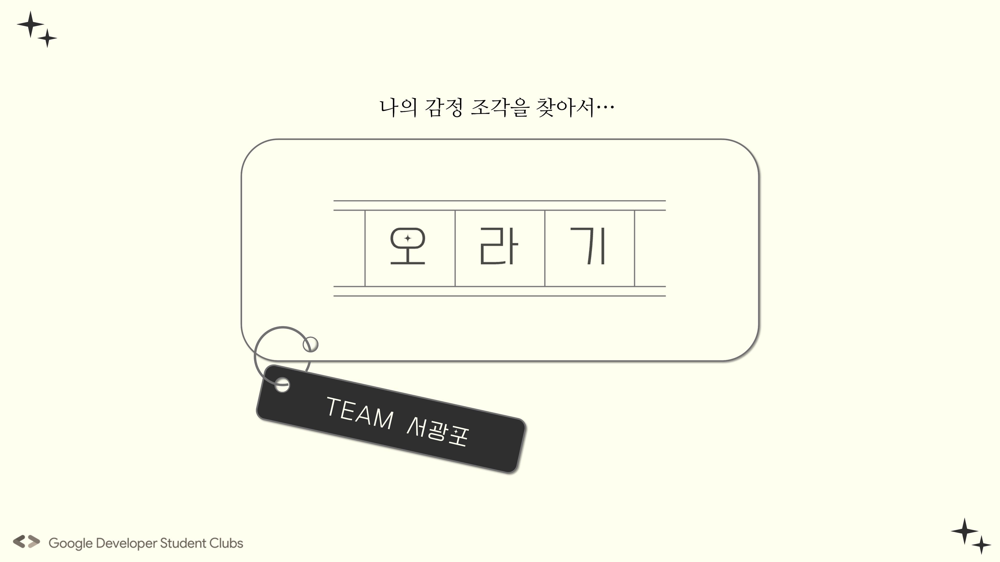
>
# Introduction

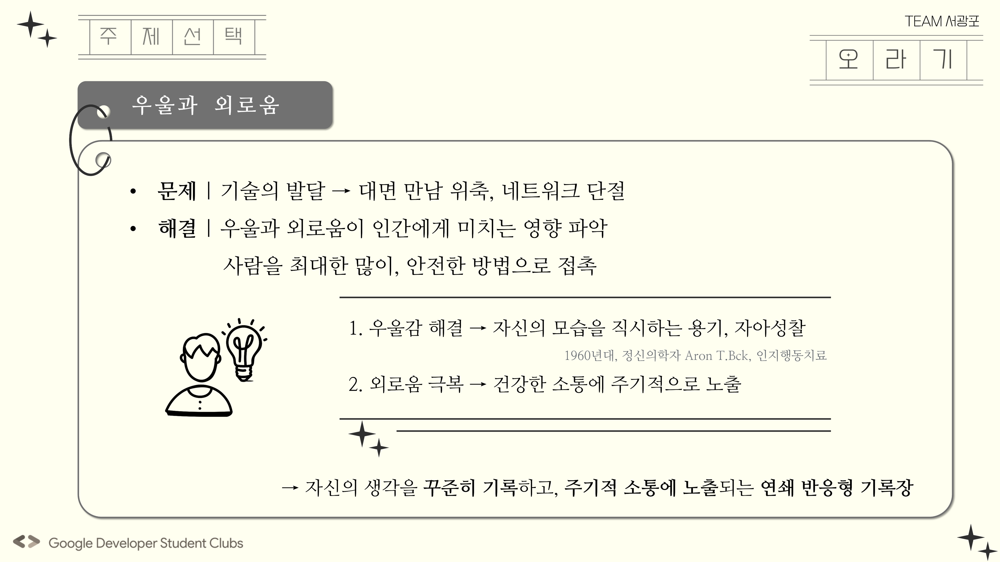
>

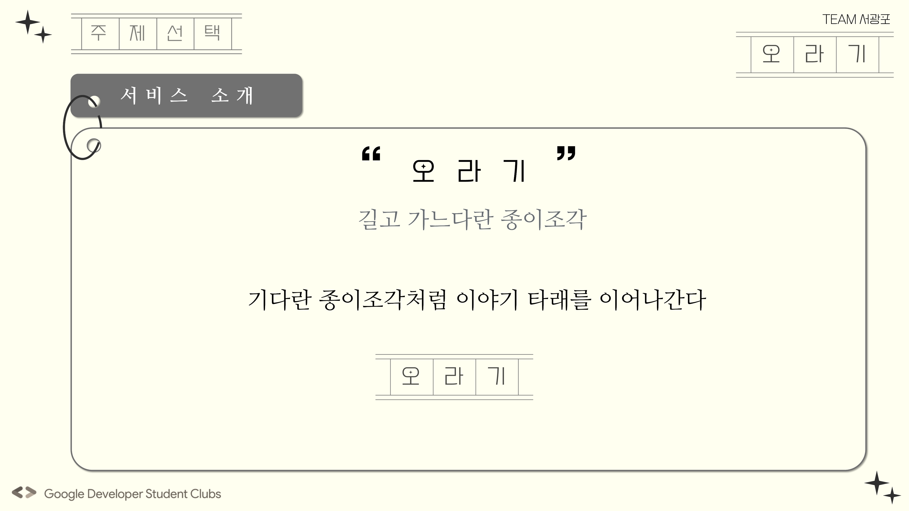
>

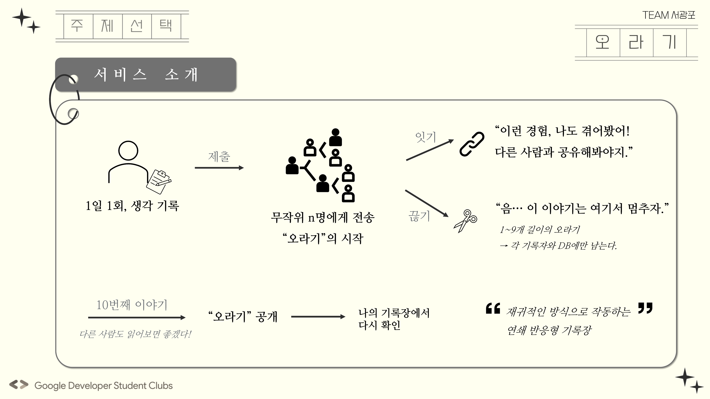
>

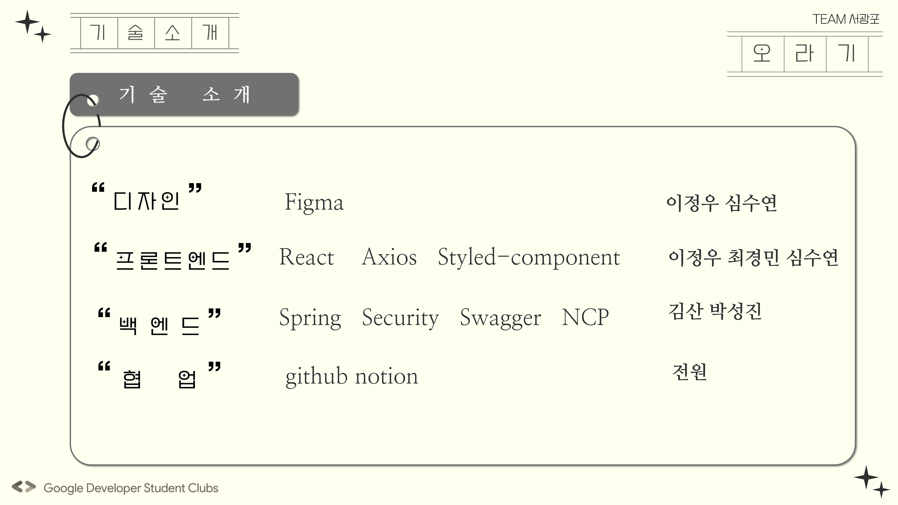
>

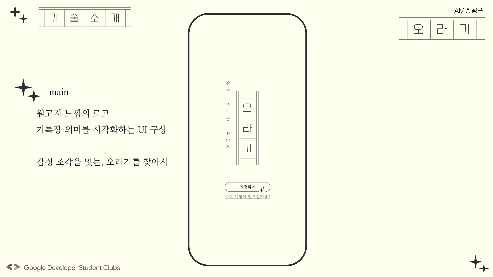
>

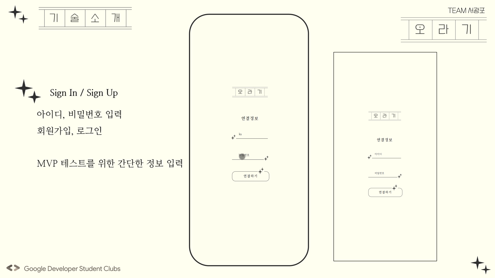
>

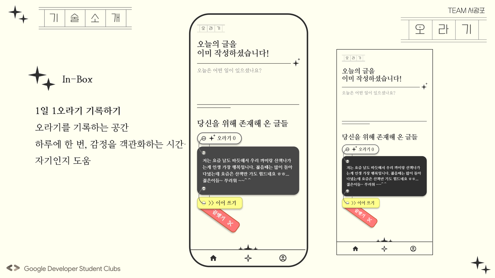
>

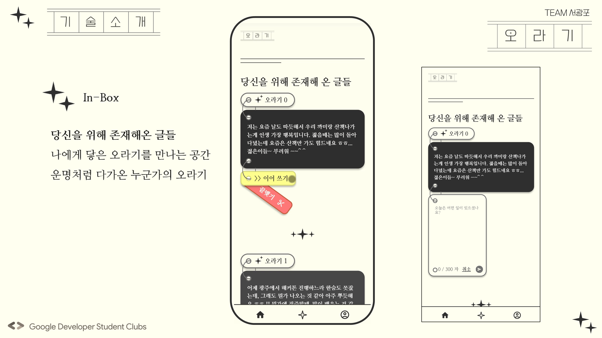
>

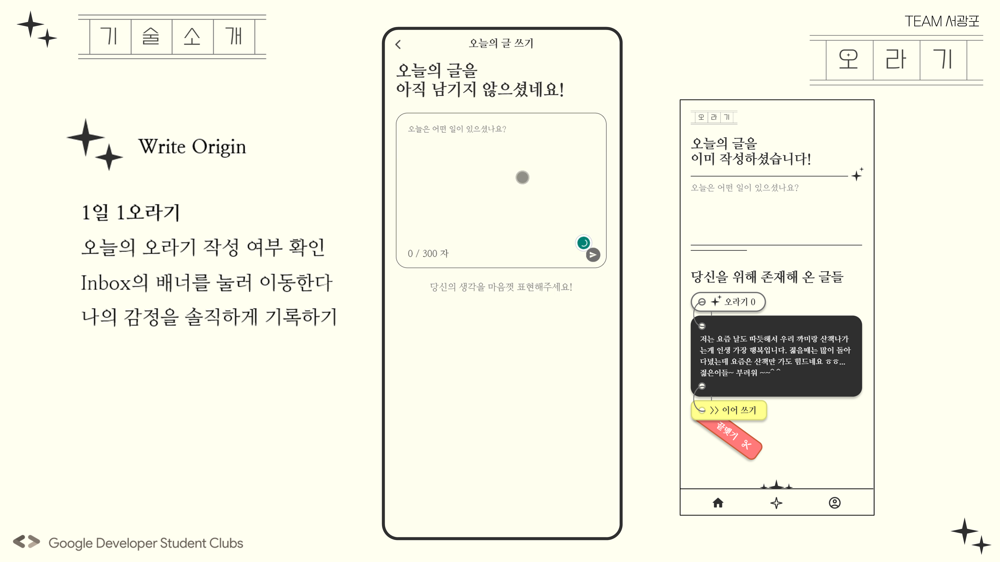
>

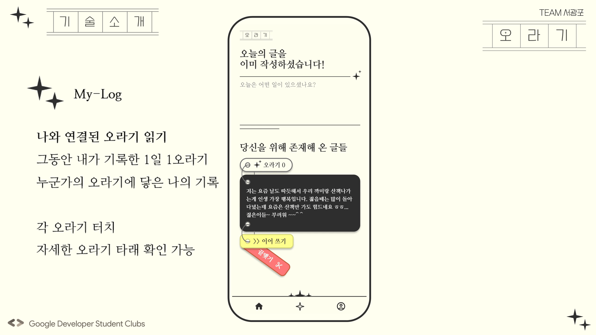

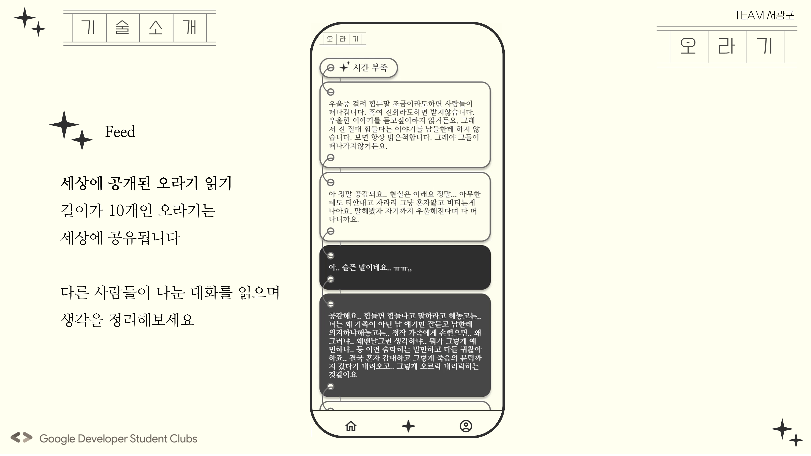
>
# 브랜치 전략

* 개인 개발 브랜치 (*-dev)
각자 브랜치를 만들어서 개발하기.

* 메인 브랜치 (master)
큰 issue 해결할 때마다 dev 브랜치에서 merge.
merge 할 때 팀원들에게 알리기.  

